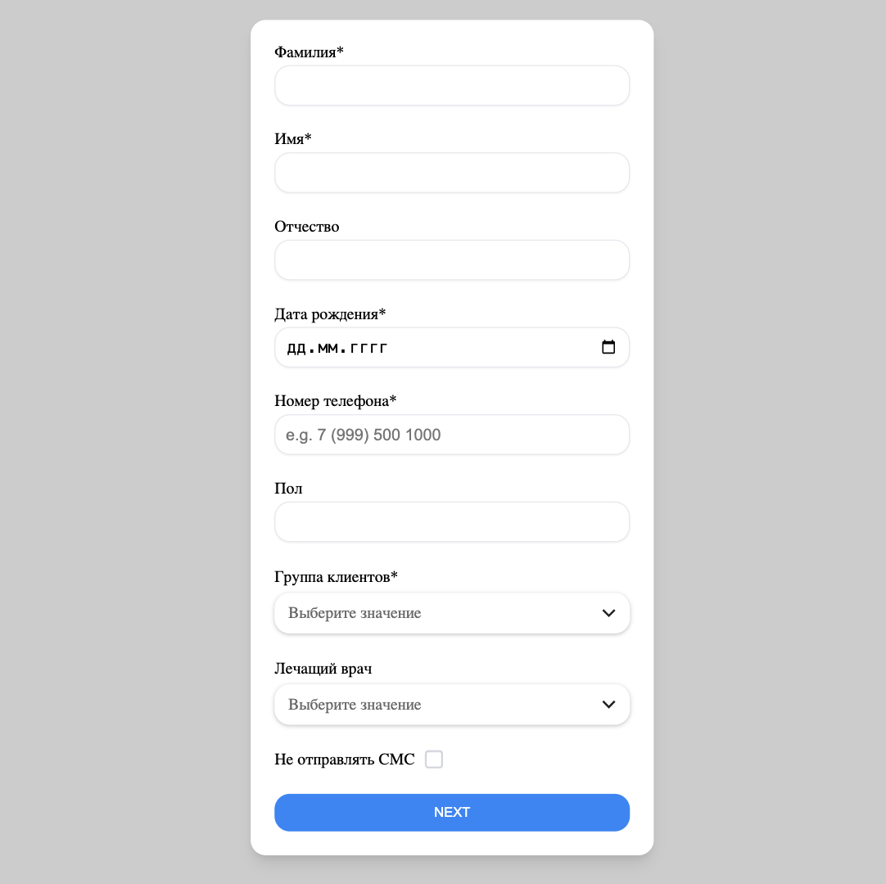

## client-form



### Link to the project: https://adzhigitovruslan.github.io/client-form/

## Description

This project is a test task designed for the Frontend Developer position

## Tech stack

- Vue2
- Sass/SCSS
- HTML

## Project setup
```
npm install
```

### Compiles and hot-reloads for development
```
npm run serve
```

### Compiles and minifies for production
```
npm run build
```

### Lints and fixes files
```
npm run lint
```

### Customize configuration
See [Configuration Reference](https://cli.vuejs.org/config/).
